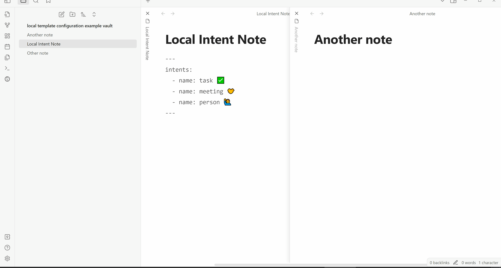

Configure note templating locally in frontmatter and insert values using prompts.

Is this [Obsidian](https://obsidian.md) plugin for you? [You should use this plugin if](#you-should-use-this-plugin-if)


Note: configuration in GIFs uses old YAML property names. All other YAML in this readme is up to date.


Notes are created by running intents.
# Intents
Intents group together templates and are the core unit of configuration in this plugin.
They represent the different intents for creating a note.
Eg: "I intend to create a meeting note".

The frontmatter of any note can hold a list of intents.
The easiest way to edit frontmatter is to enable the [source property display mode](https://help.obsidian.md/Editing+and+formatting/Properties#Display+modes) in the Obsidian settings.

Example: simple intents
```yaml
---
intents_to:
- make_a: task ✅
- make_a: meeting 🤝
- make_a: person 🙋‍♂️
---
```

## Running intents
### Local intents
The `Run local intent` command is the simplest way to run an intent.



To run a local intent, you have to select the note that contains that intent.

### Selecting a note
Another plugin called "Filtered Opener" is required to select a note from your vault.
To select a note, Filtered Opener displays a list of every note in your vault.
Filtered Opener can also be configured to display a subset of your notes using filters.
Please install the [Filtered Opener plugin](https://github.com/Balibaloo/obsidian-filtered-opener) as it is required to use this plugin.

After selecting a note, you will be shown its list of intents to chose from.
If a note only has one intent, that intent will be selected automatically.

### Global intents
Global intents are intents that are in the global intents note.

Global intents can be ran using any other note as context.
A context note is used to resolve relative paths and before running the global intent, it [imports and merges](#importing-intents) the global intents before the resulting merged intent is ran.

The `Run global intent` command runs a global intent in the global context.
The global context is the note containing global intents.
Paths relative to the global context are resolved relative to the root folder of your vault.

When global intents are configured, a command is created for each global intent called `Create local {{intent_name}} note`.
This command lets you run a global intent in a local context.

#### Configuring global intents
The global intents note is configured by setting the Global Intents Note Path in the plugin settings.
This note must be reloaded by using the `Reload global intents` command for changes to apply.

# Templates
Intents can have many note templates.

A note template contains a path to a note.
The new note will contain the contents of this template note.


The properties of templates are:
| property name | required | Default | description |
| ---- | ---- | ---- | ---- |
| `called` | Yes |  | The display name of the template |
| `at_path` | Yes |  | An alternative for `outputs_to_pathname` that allows [using variable values](#using-variable-values). The example below uses the [new_note_name](#new_note_name) variable to format the name of the new note |
| `is_disabled` | No | false | see [disabling intents, templates and variables](#disabling-intents-templates-and-variables) |
|  | |  | Additional properties covered in [New Note Properties](#new-note-properties) |


Example: intents with templates
```yaml
---
intents_to:
  - make_a: "task ✅"
    with_templates: 
      - called: "default"
        at_path: "Templates/task template.md"
      - called: "graded"
        at_path: "Templates/graded task template.md"
      - called: "worksheet"
        at_path: "Templates/worksheet task template.md"
  - make_a: "meeting 🤝"
    with_templates: 
      - called: "default"
        at_path: "Templates/meeting template.md"
      - called: "project review"
        at_path: "Templates/project review meeting template.md"
      - called: "standup"
        at_path: "Templates/standup meeting template.md"
  - make_a: "person 🙋‍♂️"
    with_templates: 
      - called: "default"
        at_path: "Templates/person template.md"
      - called: "work colleague"
        at_path: "Templates/work colleague person template.md" 
---
```

# New note properties
Both intents and templates can have a new note pathname and a list of variables.

Template new note properties overwrite intent new note properties.

Example: Task intent has 3 different templates with different output folders and note names. 


The properties of new notes are:
| property name | required | Default | description |
| ---- | ---- | ---- | ---- |
| `outputs_to_pathname` | No | A note called `new_note_name` in the same folder as the context note | The output location and name of the new note |
| `outputs_to_templated_pathname` | No | `./{{new_note_name}}` is the template representation of the above | An alternative for `outputs_to_pathname` that allows [using variable values](#using-variable-values). The example below uses the [new_note_name](#new_note_name) variable to format the name of the new note |
| `with_variables` | No |  | A list of [variables](#variables) |
| `is_disabled` | No | false | see [disabling intents, templates and variables](#disabling-intents-templates-and-variables) |


Example:
- A task intent that `outputs_to_templated_pathname`.
- A "graded task" template with an additional `date_released` variable and a custom output pathname.
- A "worksheet task" template with an additional `worksheet_number` variable and a custom output pathname.
```yaml
---
intents_to:
  - make_a: task ✅
    outputs_to_templated_pathname: ./✔ tasks/✅ {{new_note_name}}
    with_variables:
      - called: deadline
        of_type: natural_date
    with_templates:
      - called: default ✅
        at_path: Templates/task template.md
      - called: graded 🎓
        at_path: Templates/graded task template.md
        outputs_to_templated_pathname: ./✔ tasks/🎓 {{new_note_name}}
        with_variables:
          - called: date_released
            of_type: natural_date
          - called: percent
      - called: worksheet 📃
        at_path: Templates/worksheet task template.md
        outputs_to_templated_pathname: "./📃 worksheets/📃 Worksheet #{{worksheet_number}} - {{new_note_name}}"
        with_variables:
          - called: worksheet_number
            of_type: number
            is_over: 1
---
```

# Variables
There are multiple types of variables but all variables contain a common set of properties:

| property name | required | Default | description |
| ---- | ---- | ---- | ---- |
| `called` | Yes |  | The name of the variable, used when inserting values into templates. see [using variable values](#using-variable-values). <br>For the purpose of demonstration this property uses lowercase and underscores instead of spaces but it can contain any characters eg emojis. |
| `of_type` | No | [text](#text) | The type of the variable. See [variable types](#variable-types). |
| `is_required` | No | false | If `true`, when you enter an invalid value the note creation process will stop and an error message will be shown. |
| `that_prompts` | No |  | The text that is displayed when prompting. |
| `described_as` | No |  | Text that will be shown bellow the prompt. |
| `is_initially` | No |  | The value that will be in the prompt initially. |
| `uses_selection` | No | false | See [prepopulating prompts using selection](#prepopulating-prompts-using-selection). |
| `replaces_selection_with_templated` | No | \[\[{{[new_note_name](#new_note_name)}}\]\] | Template text that replaces the selection if `uses_selection` is enabled |
| `hinted_as` | No |  | The value displayed inside the prompt when it is empty. |
| `is_disabled` | No | false | See [disabling intents, templates and variables](#disabling-intents-templates-and-variables) |

There are multiple ways to use variable values. See [using variable values](#using-variable-values).

## Variable types
Each type of variable has its own parameters and validation.

### Text
A simple text prompt.
Text is the default variable type.

| property name | required | Default | description |
| ---- | ---- | ---- | ---- |
| `matches_regex`| No| |A regular expression used to validate the text

Example:
```yaml
---
with_variables:
  - called: word_starting_with_auto
    of_type: text
    matches_regex: ^auto
---
```

### Number
A simple number prompt.
Any number including integers and floats.

| property name | required | Default | description |
| ---- | ---- | ---- | ---- |
|`is_over`| No|| the minimum allowed value|
|`is_under`| No|| the maximum allowed value|

Example:
```yaml
---
with_variables:
  - called: a_number
    of_type: number
    is_over: -10.8
    is_under: 11.22
---
```

### Natural date
A natural date provided the [natural language dates](https://github.com/argenos/nldates-obsidian) plugin.


| property name | required | Default | description |
| ---- | ---- | ---- | ---- |
|`is_after` | No|| The date must be after this date. A natural language date  |
|`is_before` | No|| The date must be before this date. A natural language date |


Example:
```yaml
---
with_variables:
  - called: some_date
    of_type: natural_date
    is_after: yesterday # today or later
    is_before: next year
---
```

### Note
A path to a note chosen from a list of notes. Uses same Filtered Opener plugin as when [selecting a note](#selecting-a-note).
The Filtered Opener plugin takes the name of the filter set (`note_filter_set_name`) to display a list of notes to chose from.

| property name | required | Default | description |
| ---- | ---- | ---- | ---- |
|`note_filter_set_name`| No| Allows all notes| The name of the note filter set.|

Example:
```yaml
---
with_variables:
  - called: some_note
    of_type: note
    note_filter_set_name: maps of content
---
```


### Folder
A path to a folder chosen from a list of folders. Uses same Filtered Opener plugin as when [selecting a note](#selecting-a-note).
The Filtered Opener plugin takes the name of the filter set (`folder_filter_set_name`) to display a list of folders to chose from.

| property name | required | Default | description |
| ---- | ---- | ---- | ---- |
|`in_folder`| No| Vault root folder |A folder to start searching from, defaults to the vault folder.|
|`at_depth`| No| Depth configured in Filtered Opener  |The depth of folders to include, for a folder structure of `root/inner/leaf`, a depth of 2 will show notes down to the `leaf` level.|
|`includes_roots`|No| `false` | When `false` notes only at the specified depth are shown. When `true` notes at all levels down to the specified depth are shown.|
|`folder_filter_set_name`| No |Allows all folders | The name of the folder filter set.|

Example:
```yaml
---
with_variables:
  - called: a_project_folder
    of_type: folder
    in_folder: "/🏗 projects"
    at_depth: 1
    includes_roots: false
    folder_filter_set_name: default
---
```


## Using variable values
When using variables, text in the format of `{{variable_name}}` is replaced with the value of the variable.
If the variable called `variable_name` is not in the current intent, the `{{variable_name}}` text will not be changed.

When creating a new note, variables in the [template](#templates) are also replaced before the new file is created.

If you are already familiar with the [Templater](https://github.com/SilentVoid13/Templater) plugin, it will run its templating after the variables of this plugin are replaced.

## Advanced variable use
### new_note_name
This is a [text](#text) variable that is added to every intent automatically.

It holds the name of the new note and can be used in `outputs_to_templated_pathname` to add other text, including other variables, to the new note name.

See [new note properties](#new-note-properties)

It can also be used with a [folder](#folder) variable to chose the output folder of the new note eg [to create a project](#project)

If an intent [disables](#disabling-intents-templates-and-variables) `new_note_name` and doesn't set `outputs_to_pathname`, by default the name of the new note will be the name of the intent and it will be created in the same folder as the context note.

### Disabling intents, templates and variables
Intents, templates and variables can be disabled by setting `is_disabled` to `true`.
- Disabled intents and templates are ignored and not shown when one must be selected.
- Disabled variables are ignored, their prompts are not shown and they wont be replaced when [using variable values](#using-variable-values).

Disabled items are still [imported](#importing-intents) and can be un-hidden by setting their `is_disabled` property to `false`.

### Prepopulating prompts using selection
When running an intent, selected text can be used to pre-populate the prompts for variables.

The selection will be split using the delimiters configured in the plugin settings and then assigned to variables by the order that they appear in the variable list.

To enable this for a variable, set `uses_selection` to `true`.

If a variable is assigned a valid value from the selection, the value will be accepted and the variable prompt will be skipped.
If the value is not valid, the prompt will be shown prepopulated with the selected value.

# Configuration Schema
The full schema used by this plugin is shown in the [Intents Schema File](./intentsSchema.yaml).

When debugging intents, check the [developer console](https://forum.obsidian.md/t/how-to-access-the-console/16703).
If an intent has properties that aren't in this schema, an error will be shown.

# Importing intents
Notes can import intents from other notes using the `intents_imported_from` property.

The `intents_imported_from` property accepts any number of paths to configuration notes.
Example: Import single note
```yaml
---
intents_imported_from: "some/configuration note.md"
---
```

Example: Import a list of notes
```yaml
---
intents_imported_from: ["some/configuration note.md", "other/configuration note.md" ]
---
```

The intents of the imported notes are loaded first and are then merged with local intents.

**If an imported intent has the same name as a local intent, the imported intent properties will be overwritten by the local intent properties.**

Overwriting properties of imported intents is useful to:
- add local intents
- add local templates
  - overwrite the path with a relative local path
- enabling and [disabling intents, templates and variables](#disabling-intents-templates-and-variables)
- adding variables to intents and templates


# You should use this plugin if
- you use templates to create notes
- you want to insert variables into your templates and use prompts to capture their values
- you want to group your templates by intent
	- eg: a task, a meeting, …
- some of your intents have multiple templates
	- a normal task, a graded task, a research task
	- daily stand-up meeting, project catch-up meeting, catch-up with a colleague
- you want to extend/override your intents and templates locally to
	- use a local version of a template
	- add variables to an intent/template
	- add more intents/templates
	- …

## Additional features:
- auto-populate variable prompts with selected text
	- use multiple cursors to create multiple notes
  - replace the selected text with a link to the new note
    - use a template to change the replacement text
- supports many variable types eg text, number
	- and other types of variable providers eg: natural date, note, folder
- import other config notes

## Other plugins with overlapping functionality
Contextual Note Templating (CNT) functionality compared to:
- [Note from template](https://github.com/mo-seph/obsidian-note-from-template): Both plugins show prompts and use the selection to pre-populate fields that can be inserted into many note properties eg output folder, name, note title and body.
  - The major difference is that CNT shows one field at a time and extends the functionality of a single field.
  - CNT extends fields into [Variables](#variables). 
    - Each variable has its own configurable prompt and its type adds validation and post processing.
- [Hotkeys for templates](https://github.com/Vinzent03/obsidian-hotkeys-for-templates):
  - Instead of creating hotkeys (commands) for each template, this plugin creates commands for each [Intent](#intents).
<!-- I don't understand what [Metatemplates](https://github.com/avirut/obsidian-metatemplates) does -->


# Examples
## Simplest runnable intent
```yaml
---
intents_to:
  - make_a: task
---
```

This intent will create an empty note named the value of [new_note_name](#new_note_name) in the same folder as the context note.

## Creating in a folder
Create an empty note in a folder called `tasks` next to the context note.
```yaml
---
intents_to:
  - make_a: task
    outputs_to_templated_pathname: "./tasks/{{new_note_name}}"
---
```


Create an empty note in a folder in the root of the vault called `vault tasks`.
```yaml
---
intents_to:
  - make_a: task
    outputs_to_templated_pathname: "/vault tasks/{{new_note_name}}"
---
```

Chose a folder and place a task in its own folder in that folder.
```yaml
---
intents_to:
  - make_a: task
    with_variables:
      - called: output_folder
        is_required: true
        of_type: folder
        in_folder: ✅ tasks
        at_depth: 1
        includes_roots: false
        folder_filter_set_name: default
    outputs_to_templated_pathname: "{{output_folder}}/{{new_note_name}}/{{new_note_name}}"
---
```


## Adding templates
Adding a simple template.
```yaml
---
intents_to:
  - make_a: task
    with_templates:
      - called: simple task
        at_path: "/path /to /templates folder /simple task template.md"
---
```

Using a template next to a context note.
```yaml
---
intents_to:
  - make_a: task
    with_templates:
      - called: simple task
        at_path: "./simple task template.md"
---
```

## Create a note with its own intents
This intent creates a project note with an emoji in the project note name.
This intent disables `new_note_name` and replaces it with a `new_project_name` variable so that it doesn't replace `new_note_name` in the project note.
```yaml
---
intents_to:
  - make_a: project
    with_variables:
      - called: new_note_name
        is_disabled: true
      - called: new_project_name
    outputs_to_templated_pathname: "./{{new_project_name}}/🏗 {{new_project_name}}"
    with_templates:
      - called: default
        at_path: "/path /to /templates /project template.md"
---
```

This creates a project note with an intent that contains the project name in the task name template.
Because `new_note_name` is disabled, it wont be replaced but `new_project_name` will.
Project note template:
```yaml
---
intents_to:
  - make_a: task
    outputs_to_templated_pathname: "./tasks/{{new_project_name}}-{{new_note_name}}"
    with_templates:
      - called: simple task
        at_path: "./simple task template.md"
---

# Note for {{new_note_name}} project!
Contents of the project note template!
```


## Project
This intent creates a project note with an intent that has the project name in the task name, created in its own folder in a category folder.

In this case the `🏗 projects` folder contains subfolders that categorize projects.
This intent disables `new_note_name` and replaces it with a `new_project_name` variable so that it doesn't replace `new_note_name` in the project note.
```yaml
---
intents_to:
  - make_a: project
    with_variables:
      - called: new_note_name
        is_disabled: true
      - called: new_project_name
      - called: output_folder
        is_required: true
        of_type: folder
        in_folder: 🏗 projects
        at_depth: 1
        includes_roots: false
    outputs_to_templated_pathname: "{{output_folder}}/{{new_project_name}}/🏗 {{new_project_name}}"
    with_templates:
      - called: default
        at_path: "/path /to /templates /project template.md"
---
```

Because `new_note_name` is disabled, it wont be replaced but `new_project_name` will.
Project note template:
```yaml
---
intents_to:
  - make_a: task
    outputs_to_templated_pathname: "./tasks/{{new_project_name}}-{{new_note_name}}"
    with_templates:
      - called: simple task
        at_path: "./simple task template.md"
---

# Note for {{new_project_name}} project!
```

# Attributions
This repository uses code from the following projects:
- https://github.com/chhoumann/quickadd

Code credits are also placed in comments above code.
