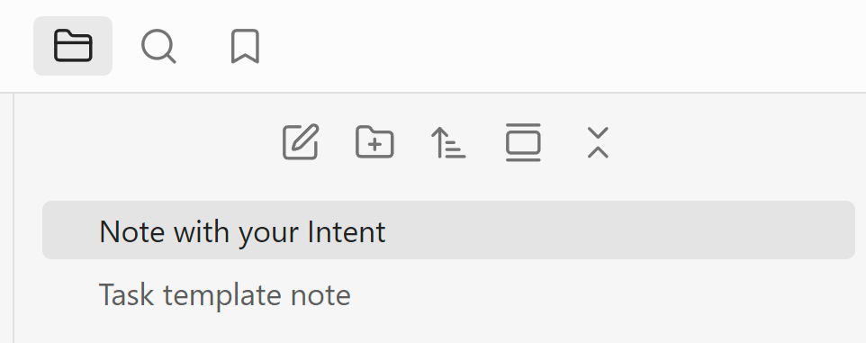

# Contextual Note Templating
An [Obsidian](https://obsidian.md) plugin for creating notes next to notes.
<br>

##### Table of contents
- [Introduction](#introduction)
- [Installing](#installing)
- <details><summary>Basics</summary>

    - [Change output note name](#change-output-note-name)
    - [Change output folder](#change-output-folder)
    - [Use a template note](#use-a-template)
    - [Add a prompt](#add-a-prompt)
  </details>

- <details> <summary>Workflow Optimizations</summary>

  - [Filter the list of notes shown](#filter-the-list-of-notes-shown)
  - [Use selected text to populate prompts](#use-selected-text-to-populate-prompts)
  - [Create a note with a hotkey](#create-note-with-a-hotkey)
  - [Create multiple notes at a time](#create-multiple-notes-at-a-time)
  - [Hide elements](#hide-elements)
  </details>

- <details> <summary>Managing many intents</summary>

  - [Import intents from other notes](#import-intents-from-other-notes)
  - [Make an intent available globally](#make-an-intent-available-globally)
  - [Disable elements](#disabling-elements)
  </details>

- <details> <summary>Appendix</summary>

  - [Reference](#Reference)
  - [Troubleshooting](#Troubleshooting)
  - [Other similar plugins](#similar-plugins)

  </details>


<!-- chapter intro summaries -->

# Introduction
Every time you make a note you need to make 3 basic decisions:<br>
(click to expand them for more context)
<details> <summary>1) <b>Where</b> should the note go?</summary>

- Should it be next to some note?
- Should it be inside a folder?
</details>

<details> <summary>2) What should be the <b>name of the new note</b>?</summary>

- Should it always have a fixed name?
- Should you be able to input its new name?
- Should it have a prefix or suffix?
</details>

<details> <summary>3) What should the <b>note have inside it</b>?</summary>

- Should it have the contents of a template?
- Are there any values that should be inputted when creating the note?
</details><br>


This is a plugin for [Obsidian](https://obsidian.md) that helps you **automate** making these decisions with the help of your existing notes.<br><br>


# Installing
This plugin is available on the [community plugins market](https://obsidian.md/plugins) in the Obsidian settings menu.<br>
If Obsidian is already installed on your device, you can [install by clicking this link](https://obsidian.md/plugins?id=contextual-note-templating).

This plugin also requires the [Filtered opener plugin](https://github.com/Balibaloo/obsidian-filtered-opener) to be installed but you can install it as required later.<br>

# Base concepts

The basic concept of the plugin is that **your notes can hold recipes to create new notes**.<br>
For example: Your project note can make a task note for itself.<br><br>


Continuing with the cooking analogy, you can have multiple versions of a recipe as well as make last minute ingredient substitutions.
You can chose the version of the recipe appropriate for the occasion and make ingredient substitutions during cooking.
<br>

In the plugin, **the general recipe is called an "Intent"**, it holds all the different versions of a recipe as well as possibilities for ingredient substitutions.
For example, you could have an Intent to create a 'task note' and another to create a 'meeting note'.
<br>

Within an Intent, **each version of a recipe is called a "Template"**.
Before creating a "meeting note" for example, you can chose between creating a "Quick catch-up" note or a big "Quarterly review" note.  
<br>

Finally when actually using a recipe, you may want to substitute different ingredients in the moment.
Your recipe can include **a "Prompt" which asks you to enter a value** like a due date or the time of the meeting.

## First recipe

A recipe is **just text** that is kept **at the start of a note** in a special place called the [Frontmatter](https://help.obsidian.md/Getting+started/Glossary#Frontmatter).<br>
When you put text at the start of your note and surround it with `---` (above and below) Obsidian is able to detect and read this special text.

The simplest recipe possible looks like this:
```yaml
---
intents_to:
  - make_a: "task"
---
```

In english it means "An intent (recipe) to make a task note".

You can use it straight away by pasting it at the start of any note (**make sure to use Command/Control + Shift + V to preserve formatting**)<br>
and then using the [command palette](https://help.obsidian.md/Plugins/Command+palette) to run the following command:<br>
- <code>Create note with intent <strong>from active note</strong></code><br>

Running this command will create a new note called "task" in the same folder as the original note.

> [!IMPORTANT]
> When you paste the recipe into your note correctly Obsidian will show it in a special view.<br>
> **The default view for Frontmatter makes it impossible to edit recipes**.<br>
> To fix it [use this documentation](https://help.obsidian.md/Editing+and+formatting/Properties#Display+modes) to **enable source mode** for note properties.


### Using a recipe for a different note

If you want to chose a different note as a starting point, use the alternative command:
- <code>Create note with intent <strong>from note</strong></code>.<br><br>

This command will show you a list of all the notes in your vault so that you can chose a starting note.<br>
There is also an option to [filter down the list of notes](#filter-the-list-of-notes-shown) to reduce the number of notes shown.
<!-- - [ ] gif -->


# Change output note name
To set a fixed name for your new note, add the `with_name` property to your intent:
```yaml
---
intents_to:
  - make_a: "task"
    with_name: "My new task"
---
```

The name of the new note will be "My new task".<br>
To input the note name when creating it, [add a prompt](#add-a-prompt).

> [!NOTE]
> You can also use this property on a template.
> See [new note properties](#new-note-properties)

<!-- - [ ] gif -->

# Change output folder
Add the `in_folder` property to your intent:
```yaml
---
intents_to:
  - make_a: "task"
    in_folder: "./tasks"
---
```

The new note will be created in a folder called "tasks" next to your note.

> [!IMPORTANT]
> Paths to notes beginning with "./" are relative to the current note.

> [!NOTE]
> You can also use this property on a template.
> See [new note properties](#new-note-properties)
<!-- - [ ] gif -->


# Use a template
First create a note and populate it with your template contents.<br>
Here is a sample note called "Task template note":
```
Task todo list:
- [ ] Example
```


In this example the note is in the same folder as the note with the intent:<br>


Then add the `with_templates` property to your intent:
```yaml
---
intents_to:
  - make_a: "task"
    with_templates:
      - called: "first template"
        at_path: "./task template"
---
```

The new note will now contain the contents of the template note.

> [!IMPORTANT]
> Paths to notes beginning with "./" are relative to the current note.

> [!NOTE]
> For advanced users:<br>
> The [Templater plugin](https://github.com/SilentVoid13/Templater) is compatible with these templates and its templating will run after > template note contents are inserted into the note.

## Use multiple templates
Add another template as shown below:
```yaml
---
intents_to:
  - make_a: "task"
    with_templates:
    - called: "first template"
      at_path: "./task template"
    - called: "second template"
      at_path: "./task template second"
---
```

When you add multiple templates, you will be prompted to select a template when creating a note.

<!-- - [ ] gif -->


# Add a prompt
A prompt is a customisable dialogue whose value can be used later.  

To add a prompt, add `with_prompts` to your intent:
```yaml
---
intents_to:
  - make_a: "task"
    with_prompts:
      - called: note_name
    with_name: "✅ {{note_name}}"
---
```

You will now be prompted to enter the name of your note when creating a note with this intent.<br>
Going further you can [customize the prompt appearance](#customizing-prompts), [add validation](#prompt-validation) and prompt for [different types of value](#prompt-types).


## Using the prompt value
To use the value entered into the prompt wrap the prompt name in double squiggly brackets like so "{{variable_name}}".<br>
Prompt values can be used in the [contents of templates](#using-the-prompt-value-in-a-template), in [intent properties](#using-the-prompt-value-in-intent-properties) and also in [subsequent prompts](#using-the-prompt-value-in-a-subsequent-prompt).

### Using the prompt value in a template
To use the prompt value in a template, include `{{variable_name}}` in your template note.<br>
For example, if you have a prompt called `note_name`, you can use `{{note_name}}` in your template and it will be replaced with the value entered.

For advanced users, plugins like [Templater](https://github.com/SilentVoid13/Templater) will run after the template contents are inserted into the new note.

### Using the prompt value in intent properties
You can use prompt values in intent properties such as `with_name` or `in_folder`. <br>
For example:

```yaml
with_name: "Task - {{note_name}}"
```
This will set the new note's name using the value entered for `note_name`.


### Using the prompt value in a subsequent prompt
After answering a prompt, it will be available to use in subsequent prompts.

In the example below, the first prompt collects the project name which is then used in the placeholder for the task name.

For example:
```yaml
with_prompts:
  - called: project_name
  - called: task_name
    is_initially: "Task for {{project_name}}"
```
Here, the placeholder for `task_name` will include the value entered for `project_name`.


# Filter the list of notes shown
When creating notes, you must first chose the starting note.<br>
To reduce number of notes that are shown, you can filter your notes with the
[Filtered opener plugin](obsidian://show-plugin?id=filtered-opener) ([this repo](https://github.com/Balibaloo/obsidian-filtered-opener))<br>
After creating a "note filter set" you can use it by selecting it in the dropdown in the settings.

# Create note with a hotkey
Every method of creating a note has a command in the [Obsidian command palette](https://help.obsidian.md/Plugins/Command+palette).<br>
Each of these commands can be assigned a hotkey in the [Obsidian hotkey settings](https://help.obsidian.md/hotkeys).

See below the full list of available commands
## List of available commands to create notes

There are two categories of commands to create notes:<br>
Local intent commands and Global intent commands.

### Local intent commands
Local intents are normal intents.<br>
They are available ONLY in the note that holds them, ie **NOT** [available in every note](#make-an-intent-available-in-all-notes).<br>
Local intents can be used with:
- <code>Create note with intent from <strong>active note</strong></code>
  - Asks you to chose an intent from the currently active note to use to create a new note.
- <code>Create note with intent from <strong>a note</strong></code>
  - Lets you chose a starting note from your valut and then does the same as <code>Create note with intent from <strong>active note</strong></code>.

### Global intent commands
Global intents are different to local notes because they<br>
ARE [available in every note](#make-an-intent-available-in-all-notes)<br>
and so have additional global commands

Global intents can be used with the same commands as [Local intents](#local-intent-commands)
But also have additional commands:
  - <code>Create note with global intent</code>
    - Asks you to chose a [global intent](#make-an-intent-available-in-all-notes) to create  
  - each global intent
    - <code>Create global XYZ</code>
    - <code>Create XYZ for note</code>


See the section on [making intents available in every note](#make-an-intent-available-in-all-notes) for more details.


# Use selected text to populate prompts
When creating a note, you can use text from your notes to auto-populate prompts.<br>
You can write out the answers to all your prompts separated by a commas

First select the text and then use any of the [available commands](#list-of-available-commands-to-create-notes) to create a note.<br><br>
The text that is selected will first be split up using the delimiters defined in the plugin settings.<br>
Then the split pieces of text will be assigned to your prompts **in the order in which they appear in the intent**.

Prompts that are assigned a valid value ([see prompt validation](#prompt-validation)) will not be shown.

This is behaviour is enabled by default and can be disabled by adding `uses_selection: false` to your prompt.

When [importing intents](#import-intents-from-other-notes), prompts imported from other notes will be inserted after the prompts in the importing note.


## Replace selected text
After creating a note from an intent, the selected text will be replaced with the value of the `replaces_selection_with` property.

By default the selected text is replaced with a link to the new note.

> [!NOTE]
> You can also use this property on a template.
> See [new note properties](#new-note-properties)

# Create multiple notes at a time
To create multiple notes at the same time, use [multiple cursors](https://help.obsidian.md/Editing+and+formatting/Multiple+cursors) to select multiple lines of text,<br>
each selection will be used to create a note the same as when [using selected text to populate prompts](#use-selected-text-to-populate-prompts).


# Hiding elements
You can hide [Intents](#intents-reference), [Templates](#templates-reference) and [Prompts](#prompts-reference) by adding `hidden: true`.

In the example below, the `useless note` intent and the "default" template for the `task` are hidden.
```YAML
---
intents_to:
  - make_a: "useless note"
    hidden: true
  - make_a: "task"
    with_templates:
      - called: "default"
        hidden: true
      - called: "special"
        at_path: "./special template"
---
```


# Import intents from other notes
Add `intents_imported_from` to your note:
```yaml
---
intents_imported_from: "/Some Folder/Note With Intents"
# or
intents_imported_from: [ "./Some Folder/First Note With Intents", "/Other Folder/Second Note With Intents"]
---
```
If any imported intents have the same name, their **properties will be merged** according the order in which they were imported.

Intent properties from notes later in the list take priority over intents from earlier notes.<br>
**Current note intents take priority over all imported intents.**

<!-- - [ ] gif create note with intent from active note -->

# Make an intent available in all notes
To make intents available globally,<br>
first place the intents in a note, then set that note as the "global intents note" in the plugin settings.<br>
**After changing the global intents note you need to use the `Reload global intents` command to load the changes**


The intents in the global intents note are available everywhere as they are [imported](#import-intents-from-other-notes) by all notes.<br>

Global intents are imported first meaning that **all other intents will override the global intents**.<br>


but also you can do intent for note, chose intent first then note, and merge with local intent

To create a note with a global intent use one of the following commands:
- `Create note with global intent`, `Create global {{intent_name}}`
- `Create {{intent_name}} for note`


This will also [create commands for each global intent](#list-of-available-commands-to-create-notes).

which allows WORKFLOW

# Disabling elements
This is different to [hiding elements](#hiding-elements).
When [importing intents](#import-intents-from-other-notes), intents will override properties even when hidden.

To enable them, you have to redefine them and add `hidden: false`

(or using [global intents](#make-an-intent-available-globally))

This means that you can un-hide elements that are hidden in the imported note.


# Examples


# Reference
This section is complete list of all the properties that can be used in the different elements.
[A concise schema file](./intentsSchema.yaml) is also available.

## Intents reference
Intents hold all the configuration of how to make a note.

[Intents introduction](#first-recipe)

| Property name | Required | Default | Description |
|-|-|-|-|
| `make_a` | Yes | | The name of the intent. |
| `with_name` | | "{{intent_name}}" | The name of the new note.<br>Defaults to the name of the intent.<br>See [changing output note name](#change-output-note-name) |
| `in_folder` |  | "./" | The output folder of the new note.<br>By default is the folder of the current note.<br> See [changing output folder](#change-output-folder) |
| `replaces_selection_with` | | "\[\[{{with_name}}]]" | The text that replaces the selection when [using selected text to populate prompts](#use-selected-text-to-populate-prompts).<br>By default is a link to the new note |
| `with_templates` | | | A list of [templates](#templates-reference) |
| `with_prompts` | | | A list of [prompts](#prompts-reference) |
| `hidden`         |          | false   | Hides the intent.<br>See [hiding elements](#hiding-elements) |
| `disabled`       |          | false   | Disables the intent.<br>See [disabling elements](#disabling-elements) |


## Templates reference

[Introduction to Templates](#use-a-template)

Templates have properties that can override intent properties when the template is used, eg `with_name`

| Property name | Required | Default | Description |
|-|-|-|-|
| `called` | Yes | | The name of the template |
| `at_path` | Yes | | The path to the template |
| `with_name` | | "{{intent_name}}" | The name of the new note.<br>Defaults to the name of the intent.<br>See [changing output note name](#change-output-note-name) |
| `in_folder` |  | "./" | The output folder of the new note.<br>By default is the folder of the current note.<br> See [changing output folder](#change-output-folder) |
| `replaces_selection_with` | | "\[\[{{with_name}}]]" | The text that replaces the selection when [using selected text to populate prompts](#use-selected-text-to-populate-prompts).<br>By default is a link to the new note |
| `hidden`         |          | false   | Hides the template.<br>See [hiding elements](#hiding-elements) |
| `disabled`       |          | false   | Disables the template.<br>See [disabling elements](#disabling-elements) |
| `with_prompts` | | | A list of [prompts](#prompts-reference) |


## Prompts reference 
[Introduction to prompts](#add-a-prompt)

| Property name    | Required | Default | Description |
|------------------|----------|---------|------------|
| `called`         | Yes      |         | The name of the prompt.<br> See [using the prompt value](#using-the-prompt-value)|
| `of_type`        |          | "text"   | One of [prompt types](#prompt-types)|
| `is_required`    |          | true    | See [Prompt validation](#prompt-validation) |
| `that_prompts`   |          | "{{called}}"   | The main text of the prompt.<br>Is the prompt name by default.<br>See [Customising prompts](#customizing-prompts)|
| `described_as`   |          |         | See [Customising prompts](#customizing-prompts)|
| `is_initially`   |          |         | The value that will be in the input by default |
| `hinted_as`      |          |         | See [Customising prompts](#customizing-prompts)|
| `uses_selection` |          | true    | See [Using selected text to populate prompts](#use-selected-text-to-populate-prompts) |
| `hidden`         |          | false   | See [Hiding elements](#hiding-elements) |
| `disabled`       |          | false   | See [Disabling elements](#disabling-elements) |


### Customizing prompts
Prompts can be customized with additional properties.
These properties also support [using prompt values in subsequent prompts](#using-the-prompt-value-in-a-subsequent-prompt)

- [ ] gif because placeholder text

| Property name | Required | Default | Description |
|-|-|-|-|
| `that_prompts`   |          | "{{called}}"   | The main text of the prompt.<br>Is the prompt name by default.<br>See [Customising prompts](#customizing-prompts)|
| `described_as`   |          |         | See [Customising prompts](#customizing-prompts)|
| `is_initially`   |          |         | The value that will be in the input by default |
| `hinted_as`      |          |         | See [Customising prompts]


### Prompt validation
Prompts can validate the values you enter.

By default all prompts require a valid value to proceed to the next step.
If an invalid value is entered into the prompt, an error message will be shown and you will be asked to enter a value again.

This can be disabled by adding `is_required: false`.

Each type of prompt has its own ways to validate the values which you can see below.


### Prompt types

This section is a list of all the types of prompt available.

To chose the type of prompt you want to use, add the `of_type` property to your prompt like so:

```yaml
---
with_prompts:
  - called: my_prompt
    of_type: number
---
```


#### Text prompt
A simple text prompt.
Text is the default prompt type.

This prompt type is called `text`

| Property name | Required | Default | Description |
| ---- | ---- | ---- | ---- |
| `matches_regex`| | |A regular expression used to validate the text

Example:
```yaml
---
with_prompts:
  - called: word_starting_with_auto
    of_type: text
    matches_regex: ^auto
---
```

#### Number prompt
A simple number prompt.
Any number including integers and floats.

This prompt type is called `number`

| Property name | Required | Default | Description |
| ---- | ---- | ---- | ---- |
|`is_over`| No|| The value must be higher than this number|
|`is_under`| No|| The value must be less than this value|

Example:
```yaml
---
with_prompts:
  - called: a_number
    of_type: number
    is_over: -10.8
    is_under: 11.22
---
```

#### Natural date prompt
A natural date from the [natural language dates](https://github.com/argenos/nldates-obsidian) plugin.

This prompt type is called `natural_date`.

| Property name | Required | Default | Description |
| ---- | ---- | ---- | ---- |
| `format` | No | Defaults to natural date setting | The output format of the natural date |
|`is_after` | No|| The date must be after this date. A natural language date |
|`is_before` | No|| The date must be before this date. A natural language date |


Example:
```yaml
---
with_prompts:
  - called: some_date
    of_type: natural_date
    format: "YYYY-MM-dd"
    is_after: yesterday # today or later
    is_before: next year
---
```

#### Note prompt
Gets a note from a list of notes.
This prompt uses the [Filtered opener plugin](https://github.com/Balibaloo/obsidian-filtered-opener) to display a list of notes to chose from.
The selected note can be output as the path to the note or just its name.

This prompt type is called `note`.

By default all notes will be shown.
You can filter down the list by specifying a `filter_set_name` from the Filtered Opener plugin settings or by specifying the individual properties of a filter set.
If both the `filter_set_name` and and other properties are defined, the properties will override the properties in the filter set.

If this overriding behaviour is active, the `filter_set_name` will include a "+" character to show that some of its properties have been overridden.

| Property name | Required | Default | Description |
| ---- | ---- | ---- | ---- |
| `filter_set_name`| | Allows all notes| The name of the note filter set.|
| `include_path_name`| | Allows all notes | Text that the path of the note must include to be shown.<br>If the path begins with "./" it will be treated as a relative path.<br>Eg, a path like "./tasks" will be resolved to the full path of the "tasks" folder next to the current note.<br>Also supports [regex](https://github.com/Balibaloo/obsidian-filtered-opener/blob/master/README.md#regular-expressions). |
| `exclude_path_name`| | Allows all notes| Same as above but matching notes are removed. |
| `include_note_name` |  | Allows all notes | Text that the note must contain. <br>Also supports [regex](https://github.com/Balibaloo/obsidian-filtered-opener/blob/master/README.md#regular-expressions). |
| `exclude_note_name` |  |  Allows all notes| Same as above but matching notes are removed. |
| `include_tags` |  | Allows all notes | A comma separated list of tags including the `#`.<br>Also supports [regex](https://github.com/Balibaloo/obsidian-filtered-opener/blob/master/README.md#regular-expressions). |
| `exclude_tags` |  | Allows all notes | Same as above but matching notes are removed. |
| `note_output_format` |  | `path`  | Can be `path` or `name`.<br>Path is the full path to the note.<br>Name is just the note name. |


Example:
```yaml
---
with_prompts:
  - called: some_note
    of_type: note
    filter_set_name: maps of content
---
```


#### Folder prompt
Gets a folder from a list of folders.
This prompt uses the [Filtered opener plugin](https://github.com/Balibaloo/obsidian-filtered-opener) to display a list of folders to chose from.
The selected folder can be output as the path to the folder or just its name.

This prompt type is called `folder`.

By default all folders will be shown.
You can filter down the list by specifying a `filter_set_name` from the Filtered Opener plugin settings or by specifying the individual properties of a filter set.
If both the `filter_set_name` and and other properties are defined, the properties will override the properties in the filter set.

If this overriding behaviour is active, the `filter_set_name` will include a "+" character to show that some of its properties have been overridden.


This prompt type is called `folder`

| Property name | Required | Default | Description |
| ---- | ---- | ---- | ---- |
| `filter_set_name`| | Allows all folders| The name of the folder filter set.|
| `include_folder_name` |  | Allows all folders | Text that the folder must contain. <br>Also supports [regex](https://github.com/Balibaloo/obsidian-filtered-opener/blob/master/README.md#regular-expressions). |
| `exclude_folder_name` |  |  Allows all folders| Same as above but matching folders are removed. |
| `include_path_name`| | Allows all folders | Text that the path of the folder must include to be shown.<br>If the path begins with "./" it will be treated as a relative path.<br>Eg, a path like "./tasks" will be resolved to the full path of the "tasks" folder next to the current folder.<br>Also supports [regex](https://github.com/Balibaloo/obsidian-filtered-opener/blob/master/README.md#regular-expressions). |
| `exclude_path_name`| | Allows all folders| Same as above but matching folders are removed. |
|`in_folder`|  | Vault root folder ("/") |The folder to search in.|
|`at_depth`|  | 1  |The number of layers of folders to include, for a folder structure of `root/inner/leaf`, a depth of 2 will show folders down to the `leaf` level.|
|`includes_roots`| | false | When `false` folders only at the specified depth are shown. When `true` folders at all levels down to the specified depth are shown.|
| `folder_output_format` |  | "path"  | path or name  |

Example:
```yaml
---
with_prompts:
  - called: a_project_folder
    of_type: folder
    in_folder: "/🏗 projects"
    at_depth: 1
    includes_roots: false
    filter_set_name: default
---
```


# Troubleshooting

invalid yaml formatting -> no intents found
unrecognized property notice

Feel free to start a discussion by [clicking this link](https://github.com/Balibaloo/obsidian-local-template-configuration/discussions/new?category=q-a).

# Similar plugins
Contextual Note Templating (CNT) functionality compared to:
- [Note from template](https://github.com/mo-seph/obsidian-note-from-template): Both plugins show prompts and use the selection to pre-populate fields that can be inserted into many note properties eg output folder, name, note title and body.
  - The major difference is that CNT shows one field at a time and extends the functionality of a single field.
  - CNT extends fields into [Prompts](#add-a-prompt). 
    - Each variable has its own configurable prompt and its type adds validation and post processing.
- [Hotkeys for templates](https://github.com/Vinzent03/obsidian-hotkeys-for-templates):
  - Instead of creating hotkeys (commands) for each template, this plugin creates commands for each [Intent](#intents-reference).
<!-- I don't understand what [Metatemplates](https://github.com/avirut/obsidian-metatemplates) does -->